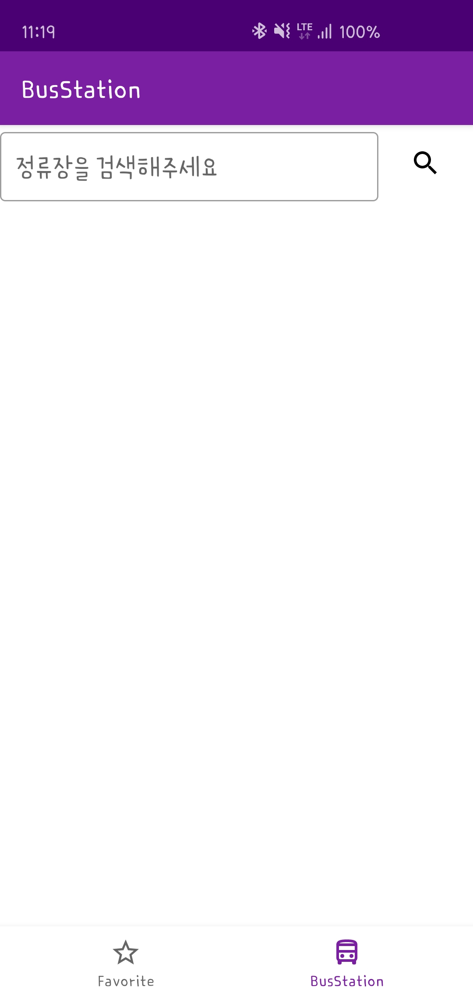
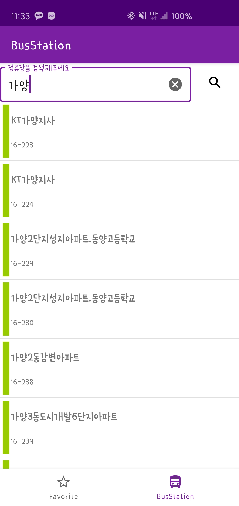
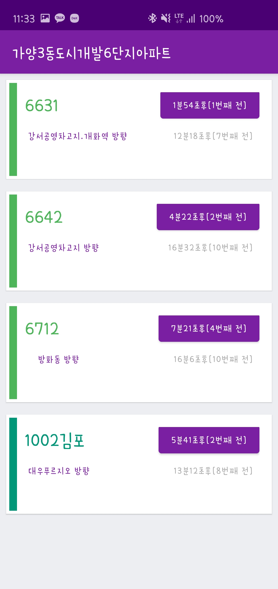
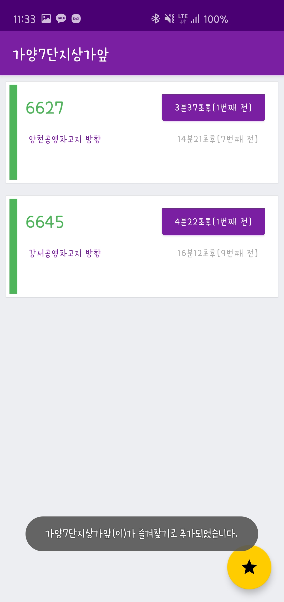
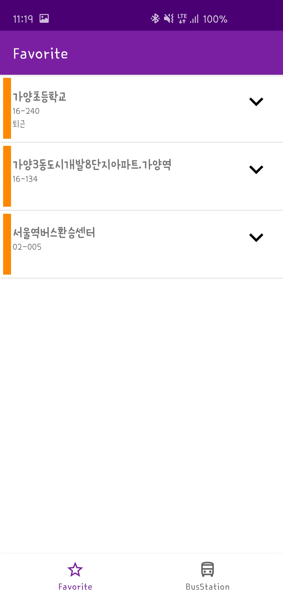
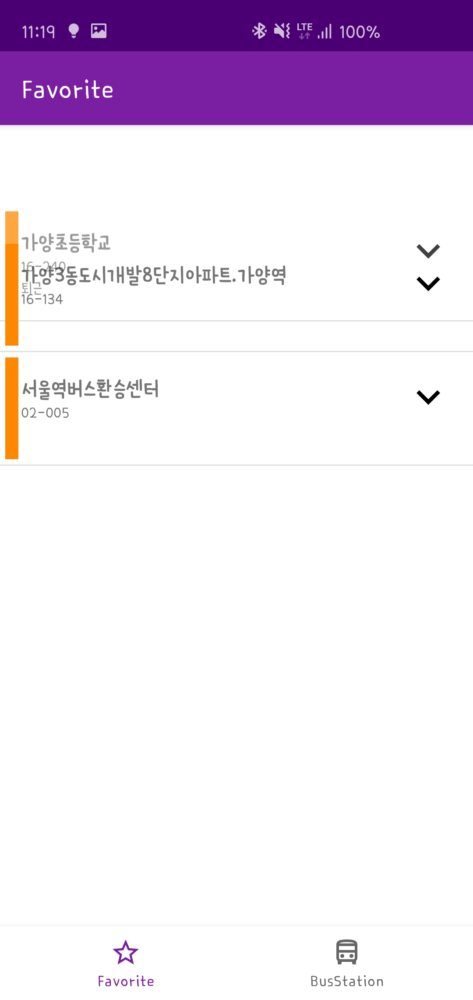

# PublicTransportExam

버스 정류장을 검색하고 정류장에 도착하는 버스 시간을 확인 할수 있는 앱
자주 가는 정류장을 즐겨찾기로 등록하여 항상 버스 도착 정보를 확인 할 수 있습니다.

### ScreenShot

### 기능

1. 버스 정류장 검색
2. 버스 정류장 즐겨찾기 기능
3. 즐겨 찾기 삭제 및 순서 변경
4. 버스 정류장에 도착하는 버스 정보 확인

### 사용된 기술

MVP, RxJava, Room, Refrofit
